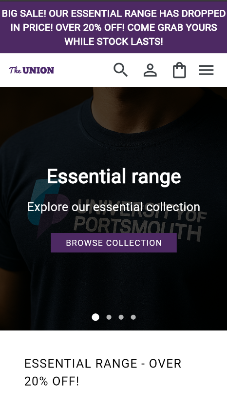
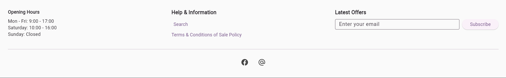

**Project Title and Description**
- **Title:** Union Shop
- **Description:** A simple Flutter storefront web/app for browsing and viewing product details. The app demonstrates a responsive landing page with hero banner, product grid, and individual product pages.


## Getting Started

**Clone and run the project:**
```bash
git clone https://github.com/Maheer-Basit/union_shop.git
cd union_shop/union_shop
flutter pub get
flutter run -d chrome
```

**Run tests:**
```bash
flutter test
```

## What's in the Project

The Union Shop is organized into clear folders so it's easy to find things. Below is a concise inventory of the actual screens and reusable widgets currently present in the project

**Main Screens** (`lib/screens/`)
- `collections_page.dart` — Top-level collections index that shows collection tiles and links into each collection.
- `collection.dart` — Single collection view: shows title, description area and a grid of product tiles for a given collection id.
- `about_page.dart` — Simple About page with site information and contact/support links.
- `product_item.dart` — Individual product details page (used with `'/product-item'` route), shows images, product info and purchase controls.
- `sign_in.dart` — Sign-in screen stub used for account/login flows.
- `print_shack_about.dart` — Content page for "The Print Shack" describing the service and examples.
- `print_shack_personalisation.dart` — Personalisation/customisation flow for print products
**Building Blocks / Widgets** (`lib/widgets/`)
- `navbar.dart` — The site navigation bar used across pages. Supports desktop hover dropdowns and a mobile popup menu with nested sections.
- `mainheader.dart` — A wrapper header that places `NavBar` and handles per-page routing callbacks.
- `hero_section.dart` — The home page hero/banner with auto-advancing slides and CTA buttons.
- `products_section.dart` — Homepage products grid (uses `tile.dart` for collection/product tiles).
- `tile.dart` — Reusable collection/product tile with image and title overlay, used by collections and product lists.
- `item.dart` — Product item content widget used by `product_item.dart` (includes the responsive image column, options and quantity controls).
- `print.dart` — `PrintCustomizer` widget for print product previews, thumbnails and personalization controls.
- `filter.dart` — Small UI for filtering and sorting product grids.
- `footer.dart` — Page footer with informational columns and social links.

**Models & Services** (`lib/models/` and `lib/services/`)
- `models/` — Data model classes such as `product.dart` and `collections.dart` define the shape of products and collections used across the app. Models are intentionally lightweight and used by UI widgets and services for typing and sample data.
- `services/` — Small in-memory services such as `product_service.dart` and `collections_service.dart` provide mock data and convenience methods to fetch products and collections. These are useful for development and for replacing with real backends later.

How Screens Use Widgets
- Screens in `lib/screens/` are thin composition layers: they fetch or receive model data (via services or route arguments) and assemble widgets from `lib/widgets/` to render complete pages. For example, `collection.dart` uses `CollectionsService` (to load a `Collections` model) and then renders a grid of `tile.dart` widgets; `product_item.dart` uses the `item.dart` widget to render the product detail UI along with header/footer.

**Screenshots**
-Home page


-Collections

-Footer

-Product


**Tests** (`test/`)
- Project tests exercise core UI behaviors (hover effects, navigation and layout) and help detect regressions when modifying header, hero, or tiles.


**Smart Design Features:**
- **Responsive**: The layout changes automatically for different screen sizes. On big desktop screens, you see 3 columns; on tablets, 2 columns; on phones, 1 column.
- **Images work everywhere**: Local images (from the `assets/images/` folder) and online images both work the same way. This keeps tests running fast and reliable.
- **Hover effects**: When using a mouse on desktop, links and tiles respond to your hovering with visual feedback (underlines, etc).
- **Auto-scrolling hero**: The big banner at the home page automatically cycles through slides so you don't have to click.

## File Organization

```
lib/
  main.dart              ← where the app starts and routes are set up
  screens/               ← full pages (Collections, About, etc.)
  widgets/               ← reusable pieces (NavBar, Hero, Footer, etc.)
test/                    ← automatic tests to keep everything working
assets/images/           ← pictures and logos used in the app
```


- **To-do**
  - Static Homepage:
    - products section []


**Contact Information**
- **Repository owner:** Maheer-Basit
- **GitHub:** https://github.com/Maheer-Basit
- **Support / Issues:** Open an issue on the repository for bugs or feature requests.

---

